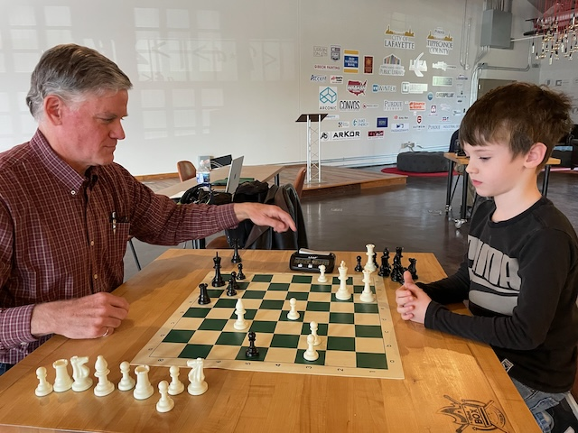

# Announcing the 2024 Chess Modeling Challenge

###### Levi Starrett

Dear Shlaer-Mellor modelers and enthusiasts,

On behalf of the One Fact team, I am excited to announce that we will be
hosting a chess modeling challenge as part of the 2024 Shlaer-Mellor Day
conference.

## Introduction

At the beginning of March 2024, the BridgePoint team released version 7.6 of
the tool. Notably, this was the very first version of BridgePoint Pro which
supports the [textual xtUML specification](TODO). We were very excited and
pleased about this release; however, it was acknowledged that the tool needed
much more real world usage in order to develop confidence in its ability to
handle production models. Around the same time I was considering possibilities
for adding new types of content to the annual conference.

Rewind to Christmas of 2023... My six-year-old son had shown an interest in
learning how to play chess and asked for a set. I taught him the rules, and it
became clear to me that he had a natural aptitude for the game. By March of
2024, he had beaten me many times (he knows the exact number), and he had even
beaten his grandpa!

With all this in mind, I was struck with the idea to host a chess modeling
challenge as a part of the conference this year. This would achieve a few key
things:

- Provide concentrated usage and testing for BridgePoint -- especially
  providing mileage on the textual persistence feature.
- Showcase some of the most central aspects of xtUML: iterative development
  with interpreted model verification followed by code generation.
- Host a fun, engaging, and educational community activity.

## The Challenge

The challenge is to create a model that can play the game of chess. A baseline
goal is to build a chess bot that can beat you in a game of chess. Another goal
is to beat my chess bot implementation,
[levifish](https://lichess.org/@/levifish), and to beat other participants in
the challenge.

A starting point model is provided to all who wish to participate and can be
found here: https://github.com/xtuml/chess

Here are the basic rules for the challenge:
- Entries must be based on the starting point model
- Entries must run in verifier
- Entries must generate code with Ciera and run as a local Java application
- Entries must be principally modeled (reasonable usage of hand-written utility
  modules is allowed)
- Entries may not access external APIs other than the provided interface to
  lichess.org

Ahead of the conference this fall (exact date still TBD), I will organize a
live tournament pitting all the implementations against one another. At the
conference, I will present the results of the tournament as well as discuss
interesting aspects of each of the implementation models.

At this point, I should mention a few disclaimers...

First, the focus of this challenge is to be on modeling the solution. It is
well known that chess is an exceedingly
[complex](https://en.wikipedia.org/wiki/Game_complexity) game, and therefore
the best analysis engines in the world for chess are highly focused on
extremely efficient and fast computation in order to determine the best moves.
In order for a chess engine modeled in xtUML to compete with modern chess
engines like Stockfish would require a highly specialized code generator
designed for speed in this particular type of application. The interpreted
Verifier in BridgePoint and general purpose model compilers available to the
community are simply not cut out to compete with the best that is publicly
available. In this challenge we will seek to highlight the interesting parts of
the domain through modeling and not worry so much about overall performance.

Second, I believe this challenge will be the most productive if it is highly
collaborative. I will be developing my entry in a public Github repository and
I encourage you to also make your implementation public as you work on it. I
encourage others to regularly view my work for inspiration. I will also be
hosing bi-weekly meetings on Zoom to discuss topics relating to the models as
well as bugs and limitations in the tooling.

## The Model

Now that I've bored you with details, I want to reward you with some
images/videos of the model in action. As alluded to above, I have already
published a partial implementation of a chess bot and you can play it right now
on lichess.com! Follow [this link](https://lichess.org/@/levifish) to go to my
bot's home page. Create an account on lichess.org and click the crossed swords
icon to challenge my bot!

Below is a YouTube video of me playing against my bot as it runs in the
BridgePoint model verifier.

## How To Get Involved

If you are interested in participating in this modeling challenge either by
submitting an entry or you simply just want to follow along, please email me at
levi.starrett@onefact.net. I will be gathering the email addresses and creating
an email list that I will use to communicate updates. Also please include your
availability on the week of June 3, 2024 as I am going to schedule a project
kickoff Zoom meeting.

In the mean time, go check out the [starting point
model](https://github.com/xtuml/chess). Follow the README to fork and clone the
repository, generate a lichess.org access token and run the application.

I'm looking forward to your participation!
Levi Starrett
